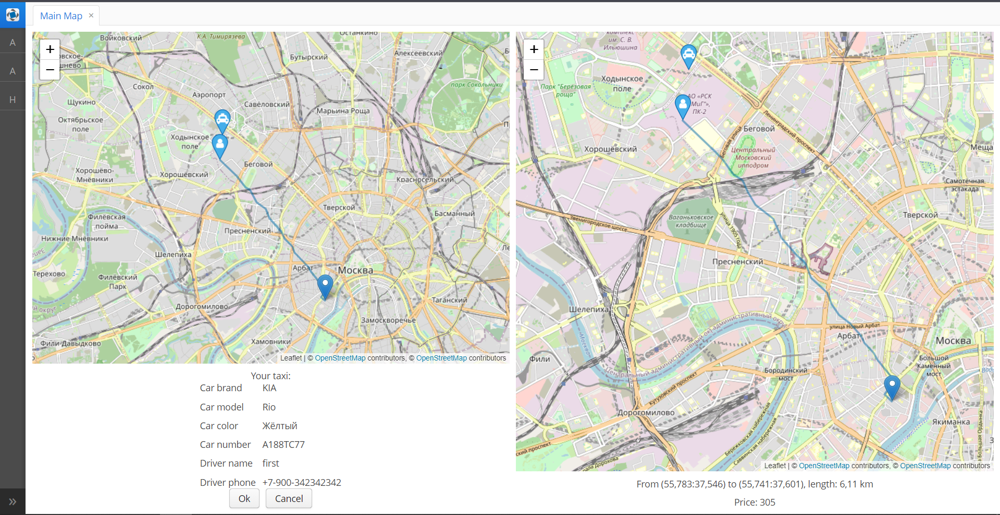

Эмулятор (мобильных) приложений пользователей сервиса "Заказ такси"

Для полноценной работы с проектом в Intellij IDEA необходима (триальная) премиум подписка на CUBA Studio (см. https://www.cuba-platform.com)    

Для сборки приложения необходима (триальная) подписка на премиум аддон Maps фреймворка CUBA Platform (https://www.cuba-platform.com/marketplace/maps/)
  
После сборки и запуска приложение можно открыть в браузере http://localhost:8080/taxi

Окно эмулятора: Главное меню -> Application -> Main map

